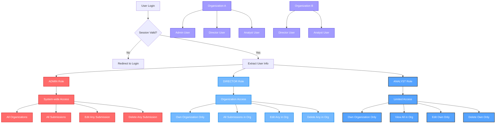

# Authentication & Authorization Flow Diagram

This diagram shows how roles and organizations work together to determine access in your tiered authentication system.

## Key Access Rules

### ADMIN Role
- **Organization Access**: All organizations
- **Submission Viewing**: All submissions across all organizations
- **Submission Editing**: Any submission
- **Submission Deletion**: Any submission
- **User Data**: Full access to all user fields

### DIRECTOR Role
- **Organization Access**: Own organization only
- **Submission Viewing**: All submissions within their organization
- **Submission Editing**: Any submission within their organization
- **Submission Deletion**: Any submission within their organization
- **User Data**: Full access to user fields

### ANALYST Role
- **Organization Access**: Own organization only
- **Submission Viewing**: All submissions within their organization
- **Submission Editing**: Only their own submissions
- **Submission Deletion**: Only their own submissions
- **User Data**: Limited fields (id, name, email, role, createdAt)

## Permission Enforcement Points

1. **Middleware**: Basic authentication check
2. **API Routes**: Role-based access control
3. **Database Queries**: Organization filtering
4. **UI Components**: Field visibility based on role
5. **Submission Operations**: Ownership and organization checks

## Security Model

The system implements a **hierarchical access control** model where:
- **ADMIN** has system-wide privileges
- **DIRECTOR** has organization-wide privileges
- **ANALYST** has self-managed privileges within their organization

This creates a secure, scalable permission system that prevents unauthorized access while allowing appropriate levels of management within organizations.
