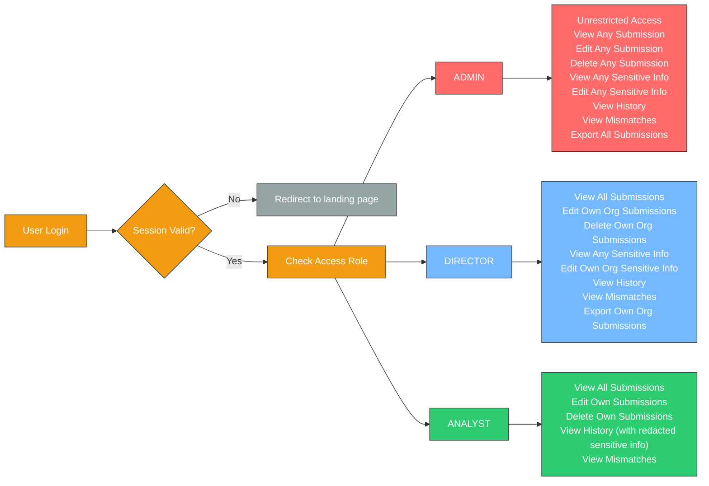
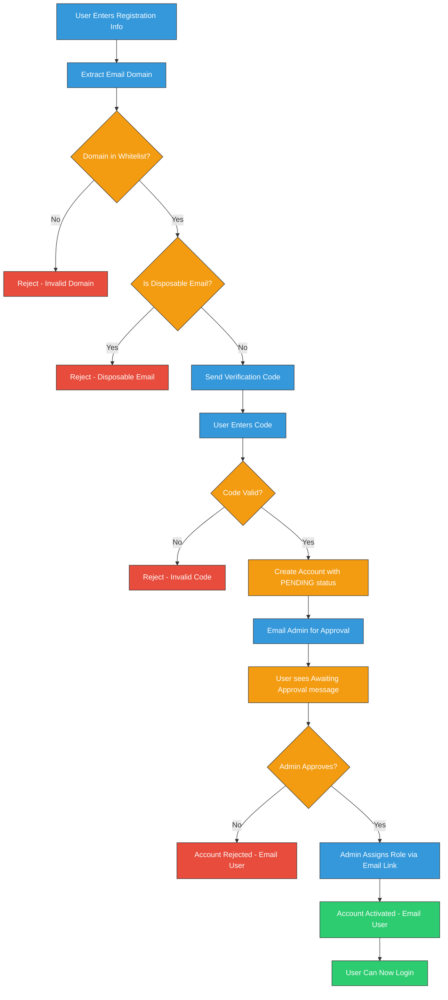

# Tiered Auth Tech Spec

## Access Matrix

The system implements a **hierarchical access control** model described below:

| Role | View Submissions | Edit Submissions | Delete Submissions | View Sensitive Information | Edit Sensitive Information | View History | View Mismatches | Download Submissions
|------|------------------|------------------|-------------------|-----------------------|---------------------------|--------------|----------------|-----------------------------|
| **ADMIN** | Any | Any | Any | Any | Any | Any | Yes | All
| **DIRECTOR** | Any | Own Org | Own Org | Any | Own Org | Any | Yes | Own Org
| **ANALYST** | Any | Own Only | Own Only | Own Only | No | Any (with redacted sensitive info) | Yes | No

This creates a secure, scalable permission system that prevents unauthorized access while allowing appropriate levels of management within organizations.

## Submission History

When editing a submission, the system would automatically tracks changes to all submissions, creating an immutable audit trail.

### How History Works

1. **Automatic Tracking** - Every time a submission is edited, a history entry is created
2. **Immutable Log** - History entries cannot be modified or deleted
3. **Complete Audit Trail** - Records who made changes, when, and what was changed

### History Entry Components

Each history entry contains:
- **Changed By**: User ID and name of who made the edit
- **Timestamp**: ISO formatted date/time of the change
- **Changes**: Array of field modifications (title/content) with:
  - Field name (title or content)
  - Old value
  - New value

All roles with view access to a submission would be able to view its complete edit history (with the exception of analyist who would not see sensitive information change history), providing transparency and accountability across the organization.

### Open Questions:

**History & Access:**
- Should a submission's history and / or sensistive information be viewable by a user of another organization?
- Should history be searchable/filterable by date range or user?

**Submission Management:**
- Can submissions be transferred between users or organizations?
- Should there be a submission "status" field (draft, submitted, reviewed, etc.)?
- Can submissions be duplicated/copied?
- Should there be bulk operations (bulk create, edit, or delete)?
- What happens to submissions if it's user or organization is deleted?

**Notifications:**
- Should users be notified when someone edits their submission?
- Should admins be notified of new submissions?

## Account Registration and Validation
- How do we ensure only legitimate institutional emails are used for registrations?

    **Approach 1: Admin-Created Accounts**
    - **Pros**: 
        - Complete control over who has access
        - Prevents fake signups
        - Simplest to implement (no validation needed)
    - **Cons**: 
        - Manual admin overhead for account creation
        - Doesn't scale well with many users
        - Users can't self-register
        - Admin needs to handle password distribution

    **Approach 2: Self-Registration with Multi-Layer Validation + Admin Approval**
    - A combination of Domain Whitelisting, Email Verification Codes, disposable email blocking, and admin approval workflow.
    - This approach adds an admin approval step after successful email verification to maintain security while allowing self-registration.

**How Admin Approval Works**:
1. User completes email verification successfully
2. Account is created with a status of "PENDING"
3. Admin receives email notification with:
   - User details (name, email, organization)
   - Link to admin dashboard approval page
   - User can optionally include a brief reason for requesting access
4. Admin clicks dashboard link to review pending registration request
5. Admin reviews request and selects appropriate role:
   - **ANALYST**: Standard user, can submit and manage own submissions
   - **DIRECTOR**: Can manage all submissions within their organization
   - **ADMIN**: Full system access (use sparingly)
6. Admin clicks "Approve" or "Reject" button
7. User receives email notification with decision:
   - If approved: "Your account has been approved as [ROLE]. You can now log in."
   - If rejected: "Your registration request has been declined. Contact support if you have questions."
8. Account status changes to `ACTIVE` (approved) or `REJECTED` (denied)
9. Approved users can log in immediately with their assigned role

**Pros**:
- Users can self-register (reduces admin manual work)
- Domain whitelist restricts to institutional emails only
- Email verification ensures they own the email
- Blocks temporary/disposable email addresses
- Admin maintains control over role assignment and final approval
- Better security than open registration
- Scales better than manual account creation

**Cons**:
- More complex implementation (4 validation layers + approval workflow)
- Need to maintain allowed domains list
- Requires paid email verification service (SendGrid, AWS SES)
- Admin must review and approve each registration request

**Recommendation**: 
- **Approach 1** is ideal for the interim phase while building and scaling the app initially (manual admin-created accounts)
- **Approach 2** becomes optimal once scaling to multiple organizations and higher user volumes, providing the right balance of automation and security control

### Other Considerations

**Managed Auth Services**
- Instead of you building, hosting, and securing our own user database and authentication logic, we can use a 3rd party managed auth service such as Clerk, Auth0, or Amazon Cognito. These services can be integrated into into the application using their SDKs.
- These managed auth services would also enable restricting registration to only whitelisted institutional domains while managing the highest level of security.
- These services can handle the admin approval workflow through their built-in admin dashboards, webhook integrations, and user metadata management, reducing the need to build custom approval interfaces from scratch.
- **Cost Consideration**: These services come with subscription fees (typically tiered pricing based on monthly active users), which must be factored into the project budget.

## Sensitive Information & CSV Export

### Sensitive Information Handling

**View Access:**
- **ADMIN**: Can view any submission's internal notes
- **DIRECTOR**: Can view any submission's internal notes
- **ANALYST**: Can not add internal notes for their own submissions

**Edit Access:**
- **ADMIN**: Can edit any submission's internal notes
- **DIRECTOR**: Can edit internal notes only for submissions in their organization
- **ANALYST**: Cannot add or edit sensitive information

**History Tracking:**
- Changes to internal notes are tracked in submission history
- Analysts see redacted history showing "internal notes" without details
- Admins and directors see full change history with before/after values

### Submission Report Exporting

**Access Control:**
| Role | Export Access | Scope |
|------|---------------|-------|
| **ADMIN** | ✅ Yes | All submissions across all organizations |
| **DIRECTOR** | ✅ Yes | Only their organization's submissions |
| **ANALYST** | ❌ No | No ability to download reports |

**Implementation Details:**
- Export button visible to admin and director roles only
- **Sensitive information excluded** from CSV exports for security
- Data filtered at database query level based on user role and organization they belong to

## Risk Assessment Mismatch Notifications:

The system can implement both **email and in-app notifications** to alert users about risk mismatches when multiple organizations submit entries with the same tag but different risk levels. Both approaches can be used together for maximum visibility and redundancy.

### When Notifications Occur

- **When a new submission is created** and conflicts with existing submission risk levels
- **When an existing submission's risk level is updated** and conflicts with other submissions sharing the same tag

### Who Receives Notifications

- All users who have created submissions with the conflicting tag (from any organization)
- Organization directors whose team members have conflicting submissions

### Email Notifications

- External alerts via email when users are not actively using the application
- Email providers: Resend (recommended), SendGrid, Nodemailer, AWS SES
- **Automated Daily Digest**: Cron jobs (scheduled tasks that run automatically at set times) can run daily outside the application to detect all existing mismatches and automatically send emails to affected users

### In-App Messaging

- Real-time notifications within the application interface
- Features: notification bell with unread count, persistent banners on affected pages
- Database-stored notifications with read/unread status
- Can be used alongside email notifications for redundancy

### Mismatch Detection Page

A dedicated page that aggregates and displays all risk mismatches across the system:
- Lists all tags with conflicting risk levels
- Shows submission count and involved organizations for each mismatch
- Displays all conflicting risk levels with color-coded badges
- Provides quick links to view detailed submission comparisons
- Enables users to quickly identify and resolve discrepancies

